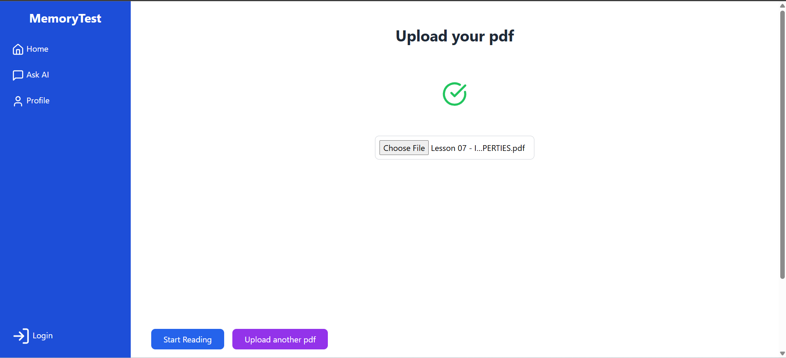
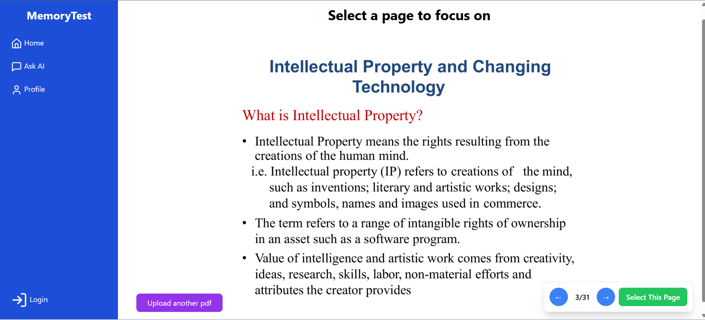
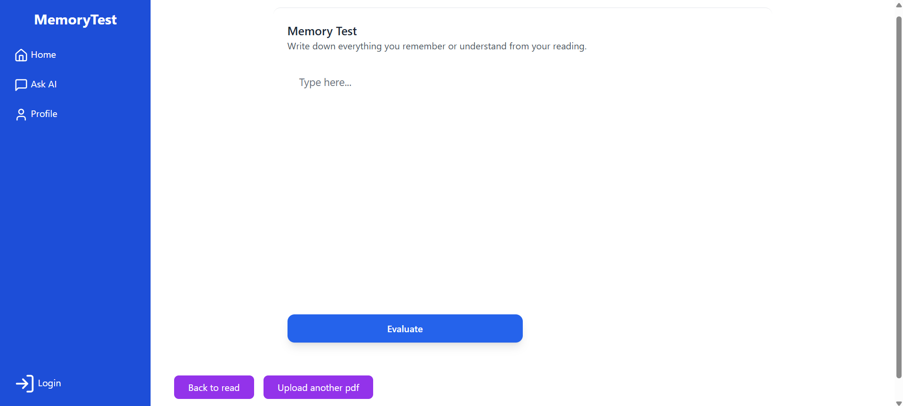
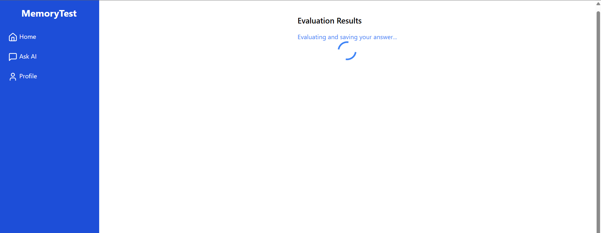
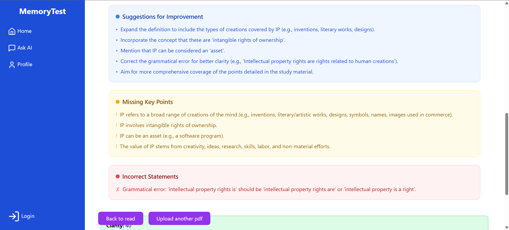
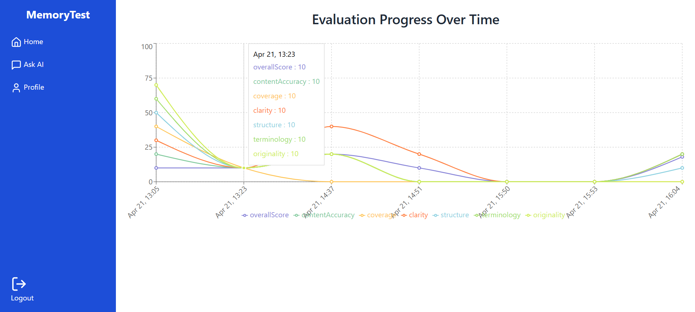

# 🧠 Memory Evaluation

---

## 📸 Screenshots

<table>
  <tr>
    <td align="center">
      <br/>
      <b>Upload Study Material</b>
    </td>
    <td align="center">
      <br/>
      <b>PDF Page Select to Read</b>
    </td>
    <td align="center">
      <br/>
      <b>Read Selected</b>
    </td>
  </tr>
  <tr>
    <td align="center">
      <br/>
      <b>Answer Input</b>
    </td>
    <td align="center">
      <br/>
      <b>AI Evaluation Feedback</b>
    </td>
    <td align="center">
      <br/>
      <b>Results</b>
    </td>
  </tr>
  <tr>
    <td align="center" colspan="3">
      <br/>
      <b>User Progress</b>
    </td>
  </tr>
</table>

---

## 📋 Description

Memory Evaluation is a web application built with **React**, **.NET Web API**, and **Python Flask**. It helps users test and improve their memory by allowing them to:

- Upload and read study materials  
- Write answers based on what they remember  
- Receive detailed AI-powered feedback and scoring  

---

## 🛠 Tech Stack

- **Frontend:** React.js  
- **Backend:** .NET Web API  
- **AI & Evaluation:** Python Flask  
- **Database:** SQL Server  

---

## ⚙️ Setup Instructions

### Frontend (React)

```bash
git clone https://github.com/dilshannirodha/Memory-testing-application-dotnet-react-flask.git
cd Memory-testing-application-dotnet-react-flask/frontend
npm install
npm start
