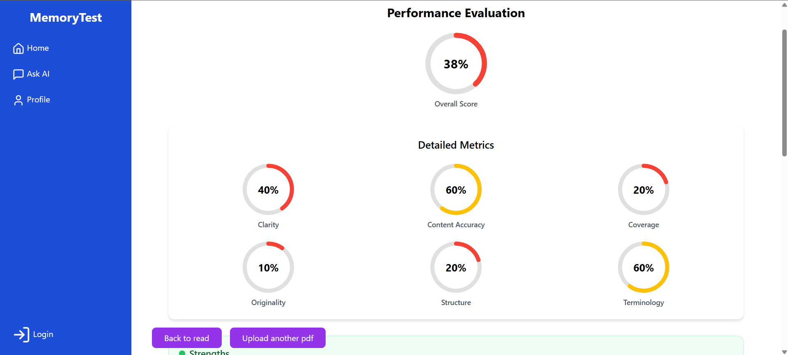

## 📸 Screenshots

<table>
  <tr>
    <td align="center">
       
      <b>Upload Study Material</b>
    </td>
    <td align="center">
       
      <b>PDF page select to read</b>
    </td>
        <td align="center">
       
      <b>Read selected</b>
    </td>
        <td align="center">
       
      <b>Answer</b>
    </td>
        <td align="center">
       
      <b>Ecaluate</b>
    </td
          <td align="center">
       
      <b>feedback</b>
    </td>
        <td align="center">
       
      <b>result</b>
    </td>
    <td align="center">
       
      <b>Progress</b>
    </td>
  </tr>
</table>

# 🧠 Memory Evaluation
---

## 📋 Description

Memory Evaluation is a web application built with **React**, **.NET Web API**, and **Python Flask**. It helps users test and improve their memory by allowing them to:

- Upload and read study materials  
- Write answers based on what they remember  
- Receive detailed AI-powered feedback and scoring  

---

## 🛠 Tech Stack

- Frontend: React.js  
- Backend: .NET Web API  
- AI & Evaluation: Python Flask  
- Database: SQL Server  

---

## ⚙️ Setup Instructions
